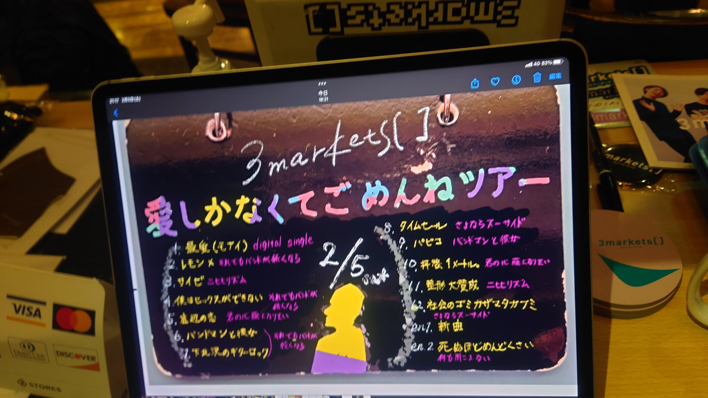

## 愛しかなくてごめんねツアー大阪公演

### ライブ情報

公演日
:    2022-02-05

出演者
:    3markets[ ] / OKOJO / シンガーズハイ

ライブハウス
:    [大阪Music Club JANUS](livehouse016.html)

公式Tweet
:    [https://twitter.com/3markets/status/1490120579114213377](https://twitter.com/3markets/status/1490120579114213377)

その他コメント
:    

### セットリスト

*  1: [最愛(モアイ)](song014.html)
*  2: [レモン×](song003.html)
*  3: [サイゼ](song004.html)
*  4: [僕はセックスが出来ない](song006.html)
*  5: [底辺の恋](song008.html)
*  6: [バンドマンと彼女](song009.html)
*  7: [下北沢のギターロック](song015.html)
*  8: [タイムセール](song007.html)
*  9: [パピコ](song036.html)
*  10: [拝啓、1メートル。](song010.html)
*  11: [整形大賛成](song005.html)
*  12: [社会のゴミカザマタカフミ](song002.html)
*  en1: [新曲](song001.html)
*  en2: [死ぬほどめんどくさい](song018.html)

### 追加情報

<blockquote class="twitter-tweet">
ツアー2日目、JUNUSありがとうございました！ mcで言った、いろんな病気はいつかきっと消えるけど、今日という日や音楽は記憶から一生消えないから…って話はマジだと思ってます。音楽って聴かなくなっても無くなりはしなくてすごいな〜と思います。OKOJO本当ありがとう。シンガーズハイは早く治して… <a href="https://t.co/F4o3HXMzTO">pic.twitter.com/F4o3HXMzTO</a>
&mdash; 3markets［ ］ (@3markets) <a href="https://twitter.com/3markets/status/1490120579114213377?ref_src=twsrc%5Etfw">February 6, 2022</a></blockquote>

