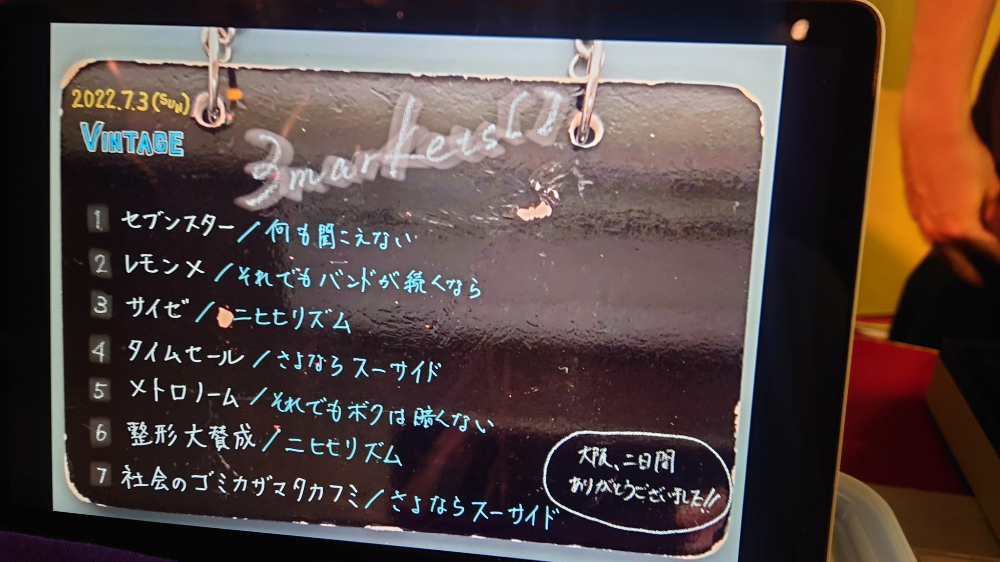

## 寝屋川VINTAGE38周年公演 孔明臥竜

### ライブ情報

公演日
:    2022-07-03

出演者
:    3markets[ ] / Blue Mash / Atomic Skipper / hananashi

ライブハウス
:    [寝屋川VINTAGE](livehouse022.html)

公式Tweet
:    [https://twitter.com/3markets/status/1543603963534413830](https://twitter.com/3markets/status/1543603963534413830)

その他コメント
:    

### セットリスト

*  1: [セブンスター](song020.html)
*  2: [レモン×](song003.html)
*  3: [サイゼ](song004.html)
*  4: [タイムセール](song007.html)
*  5: [メトロノーム](song025.html)
*  6: [整形大賛成](song005.html)
*  7: [社会のゴミカザマタカフミ](song002.html)

### 追加情報

<blockquote class="twitter-tweet">
寝屋川ありがとうございました！！とてもよい大阪2日間でした……この2日間は…アキラのギター教室合宿…だったのかな……強くなるぞ……  セットリスト  セブンスター レモン× サイゼ タイムセール メトロノーム 整形大賛成 社会のゴミカザマタカフミ <a href="https://t.co/Sm5BzsvmDv">pic.twitter.com/Sm5BzsvmDv</a>
&mdash; 3markets［ ］→2/24恵比寿LIQUIDROOM (@3markets) <a href="https://twitter.com/3markets/status/1543603963534413830?ref_src=twsrc%5Etfw">July 3, 2022</a></blockquote>

