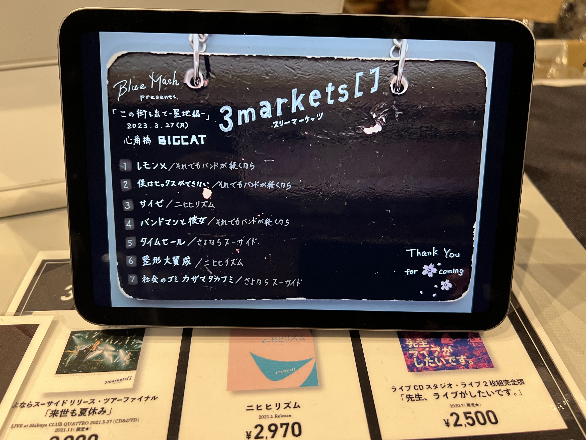

## Blue Mash presents.「この街を出て-聖地編-」

[TOP](/setlist/) > [ライブ一覧](lives.html) > Blue Mash presents.「この街を出て-聖地編-」

___

<a href="https://twitter.com/share?ref_src=twsrc%5Etfw" data-text="3markets[ ]セットリスト > Blue Mash presents.「この街を出て-聖地編-」" class="twitter-share-button" data-via="3markets" data-hashtags="3markets" data-related="3markets" data-show-count="false">Tweet</a>

### ライブ情報

公演日
:    2023-03-27

出演者
:    3markets[ ] / ほか出演者多数

ライブハウス
:    [心斎橋BIGCAT](livehouse055.html)

公式Tweet
:    [https://twitter.com/3markets/status/1640350346508914688](https://twitter.com/3markets/status/1640350346508914688)

その他コメント
:    

### セットリスト

*  リハ1: [愛の返金](song012.html)
*  リハ2: [OBEYA](song021.html)
*  リハ3: [さよならスーサイド](song013.html)
*  1: [レモン×](song003.html)
*  2: [僕はセックスが出来ない](song006.html)
*  3: [サイゼ](song004.html)
*  4: [バンドマンと彼女](song009.html)
*  5: [タイムセール](song007.html)
*  6: [整形大賛成](song005.html)
*  7: [社会のゴミカザマタカフミ](song002.html)

### 追加情報

<blockquote class="twitter-tweet">
BlueMash企画ありがとうございました…ボーカルのゆうとが別れ際に「いてくれてよかった」って言ってくれたので来てよかったな…と思いました…ありがとう…  セトリ  レモン× セ サイゼ バンドマンと彼女 タイムセール 整形大賛成 社会のゴミカザマタカフミ  次回は5/3に大阪きます… <a href="https://t.co/U6f3XgUquA">pic.twitter.com/U6f3XgUquA</a>
&mdash; 3markets［ ］ (@3markets) <a href="https://twitter.com/3markets/status/1640350346508914688?ref_src=twsrc%5Etfw">March 27, 2023</a></blockquote>

