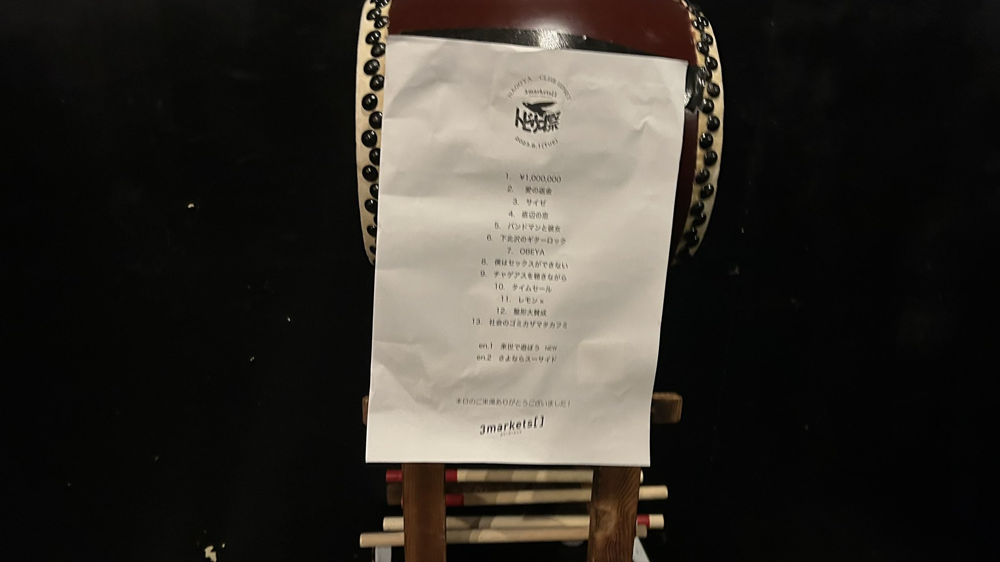

## 「トビウオ祭 夏」名古屋公演

[TOP](/setlist/) > [ライブ一覧](lives.html) > 「トビウオ祭 夏」名古屋公演

___

<a href="https://twitter.com/share?ref_src=twsrc%5Etfw" data-text="3markets[ ]セットリスト > 「トビウオ祭 夏」名古屋公演" class="twitter-share-button" data-via="3markets" data-hashtags="3markets" data-related="3markets" data-show-count="false">Tweet</a>

### ライブ情報

公演日
:    2023-08-01

出演者
:    ワンマン

ライブハウス
:    [名古屋UPSET](livehouse024.html)

公式Tweet
:    [https://twitter.com/3markets/status/1686362873193488384](https://twitter.com/3markets/status/1686362873193488384)

その他コメント
:    

### セットリスト

*  1: [\1,000,000](song022.html)
*  2: [愛の返金](song012.html)
*  3: [サイゼ](song004.html)
*  4: [底辺の恋](song008.html)
*  5: [バンドマンと彼女](song009.html)
*  6: [下北沢のギターロック](song015.html)
*  7: [OBEYA](song021.html)
*  8: [僕はセックスが出来ない](song006.html)
*  9: [チャゲアスを聴きながら](song070.html)
*  10: [タイムセール](song007.html)
*  11: [レモン×](song003.html)
*  12: [整形大賛成](song005.html)
*  13: [社会のゴミカザマタカフミ](song002.html)
*  en1: [来世で遊ぼう](song075.html)
*  en2: [さよならスーサイド](song013.html)

### 追加情報

<blockquote class="twitter-tweet">
3markets[ ] ワンマンツアー 「トビウオ祭 夏」 今池CLUB UPSET ご来場、ありがとうございました。 まさかアレがアレしてお客さんもアレできるとは思いませんでしたね。  明日は大阪です。明日も元気にがんばるぞい。  Photo by イノコシ ゼンタ(<a href="https://twitter.com/zen_photo_nikon?ref_src=twsrc%5Etfw">@zen_photo_nikon</a>)<a href="https://twitter.com/hashtag/%E3%82%B9%E3%83%AA%E3%83%9E%E3%81%AE%E3%83%88%E3%83%93%E3%82%A6%E3%82%AA%E7%A5%AD%E5%A4%8F?src=hash&amp;ref_src=twsrc%5Etfw">#スリマのトビウオ祭夏</a> <a href="https://t.co/8hetdxG6Px">pic.twitter.com/8hetdxG6Px</a>
&mdash; 3markets［ ］ (@3markets) <a href="https://twitter.com/3markets/status/1686362873193488384?ref_src=twsrc%5Etfw">August 1, 2023</a></blockquote>

