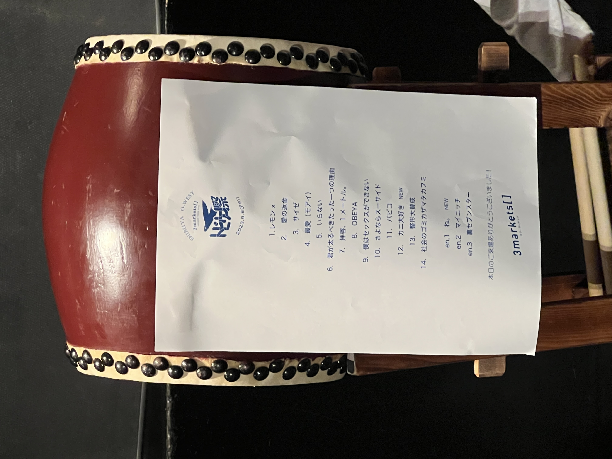

## 「トビウオ祭 夏」東京追加公演

[TOP](/setlist/) > [ライブ一覧](lives.html) > 「トビウオ祭 夏」東京追加公演

___

<a href="https://twitter.com/share?ref_src=twsrc%5Etfw" data-text="3markets[ ]セットリスト > 「トビウオ祭 夏」東京追加公演" class="twitter-share-button" data-via="3markets" data-hashtags="3markets" data-related="3markets" data-show-count="false">Tweet</a>

### ライブ情報

公演日
:    2023-09-08

出演者
:    ワンマン

ライブハウス
:    [渋谷Spotify O-West](livehouse009.html)

公式Tweet
:    [https://twitter.com/3markets/status/1700119899614617617](https://twitter.com/3markets/status/1700119899614617617)

その他コメント
:    

### セットリスト

*  1: [レモン×](song003.html)
*  2: [愛の返金](song012.html)
*  3: [サイゼ](song004.html)
*  4: [最愛(モアイ)](song014.html)
*  5: [いらない](song078.html)
*  6: [君が太るべきたった一つの理由](song034.html)
*  7: [拝啓、1メートル。](song010.html)
*  8: [OBEYA](song021.html)
*  9: [僕はセックスが出来ない](song006.html)
*  10: [さよならスーサイド](song013.html)
*  11: [パピコ](song036.html)
*  12: [カニ大好き](song079.html)
*  13: [整形大賛成](song005.html)
*  14: [社会のゴミカザマタカフミ](song002.html)
*  en1: [ね。](song076.html)
*  en2: [マイニッチ](song046.html)
*  en3: [裏セブンスター](song017.html)

### 追加情報

<blockquote class="twitter-tweet">
3markets[ ] ワンマンツアー追加公演 「トビウオ祭 夏」 渋谷O-WEST 全然5公演超絶ありがとうございました🐟 夏のトビウオ祭は閉幕だけどまだまだ夏休みしようぜ！！！<a href="https://twitter.com/hashtag/%E4%B8%80%E7%94%9F%E5%A4%8F%E4%BC%91%E3%81%BF?src=hash&amp;ref_src=twsrc%5Etfw">#一生夏休み</a>  📷by <a href="https://twitter.com/ni_____mi?ref_src=twsrc%5Etfw">@ni_____mi</a> <a href="https://t.co/p3c6dECLoL">pic.twitter.com/p3c6dECLoL</a>
&mdash; 3markets［ ］ (@3markets) <a href="https://twitter.com/3markets/status/1700119899614617617?ref_src=twsrc%5Etfw">September 8, 2023</a></blockquote>

